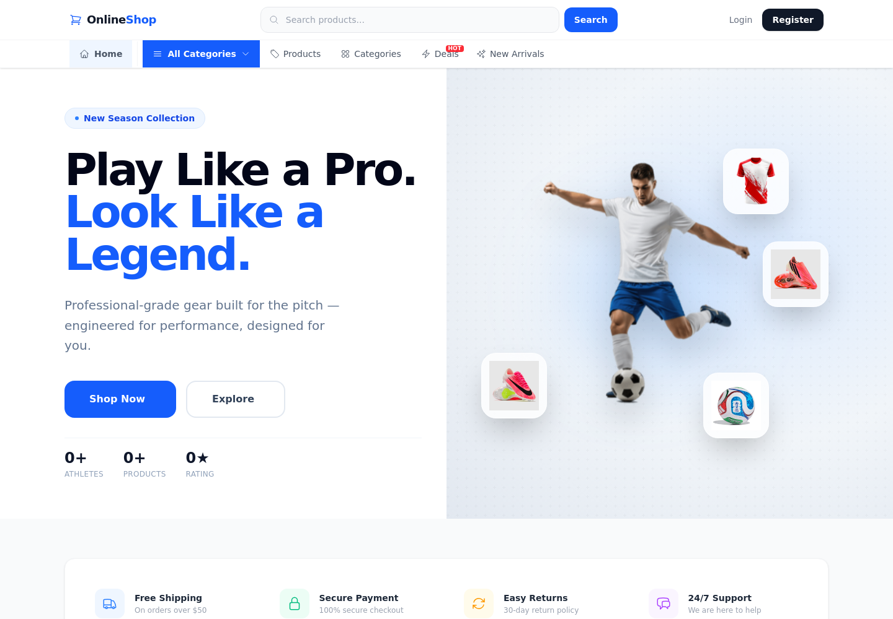
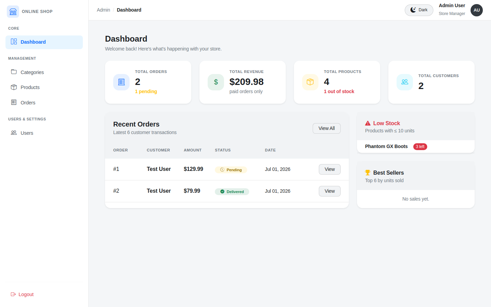
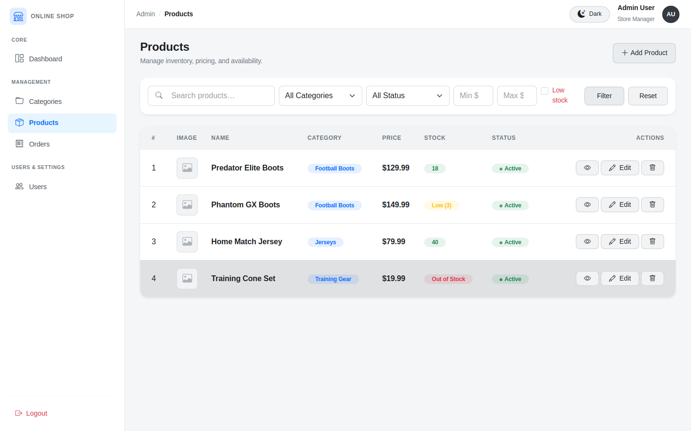
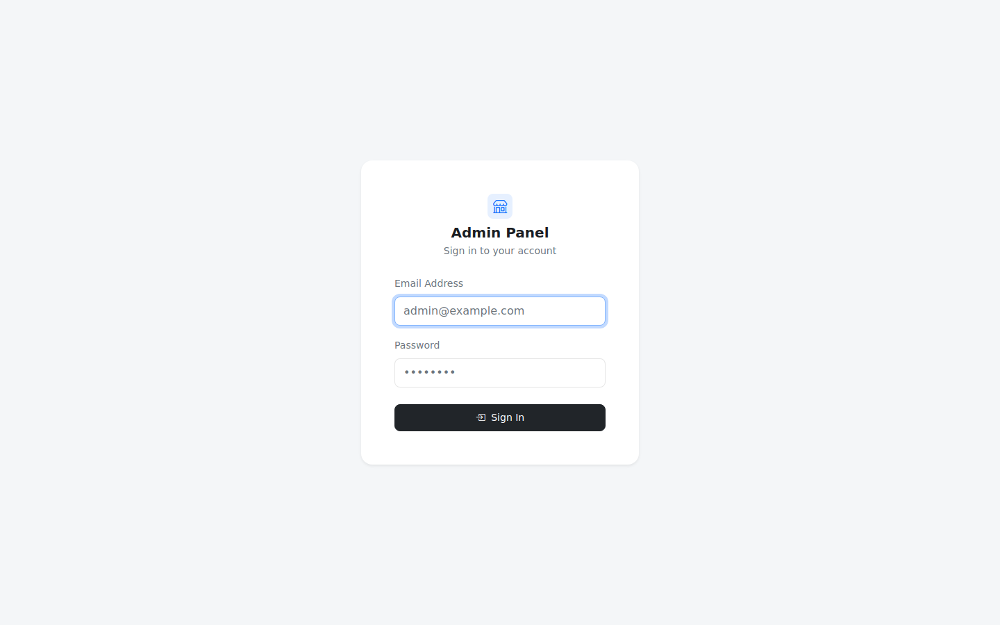

# Online Shop — Backend (Laravel API)

A REST API for **Online Shop**, a football/soccer equipment e-commerce platform. Built with **Laravel 12** and **Laravel Sanctum**, it powers product browsing, cart, wishlist, checkout, orders, reviews, and authentication (including Google OAuth) for the [Vue 3 frontend](../frontend/README.md).


*Screenshot of the storefront rendered by the paired frontend, calling into this API.*

## Tech Stack

- **PHP 8.2+** / **Laravel 12**
- **Laravel Sanctum** — token-based SPA authentication
- **MySQL** (default) — configurable via `.env`
- **Google OAuth 2.0** — social login
- Eloquent models with dedicated API controllers

## Features

- Email/password registration & login, plus **Google Sign-In**
- Product catalog with search, filtering, and related products
- Categories
- Cart (add / update / remove / clear)
- Wishlist
- Checkout → Orders, with order cancellation and status tracking
- Product reviews (create / update / delete)
- User profile management (details + password change)
- Store-wide stats endpoint (e.g. for homepage counters)
- Token-protected private routes via `auth:sanctum`

## Admin Panel

Alongside the JSON API, this project ships a **server-rendered admin dashboard** (Blade + Bootstrap 5, not part of the Vue frontend) for store management.


*Dashboard: order/revenue totals, low-stock alerts, and recent orders.*


*Products list with filters, stock/status badges, and inline actions.*

- **URL:** `/admin` (root `/` redirects here)
- **Auth:** session-based, via the standard `web` guard (`Auth::attempt`) — no separate `role`/`is_admin` flag is checked, so **any registered user** who logs in at `/admin/login` with valid credentials gets in. Restrict this (e.g. add an `is_admin` column and gate the routes) before using this in anything beyond local/dev.
- **Login:** `admin@example.com` / `password123` (seeded by `AdminSeeder`)



| Route | Description |
|---|---|
| `GET /admin/login` | Login form |
| `POST /admin/login` | Authenticate |
| `POST /admin/logout` | Log out |
| `GET /admin` | Dashboard — order/revenue/product/user totals, pending orders, low-stock & out-of-stock alerts, best sellers, recent orders |
| `resource /admin/categories` | Category CRUD (create/edit via modals) |
| `resource /admin/products` | Product CRUD (create/edit via modals, filters) |
| `resource /admin/orders` | Order list + detail view (status/customer info) |
| `resource /admin/users` | User list + filters |

Views live in `resources/views/admin/`, controllers in `app/Http/Controllers/Admin/`, routes in [`routes/web.php`](routes/web.php). It supports light/dark theming via CSS custom properties.

## Project Structure

```
backend/
├── app/
│   ├── Http/Controllers/
│   │   ├── API/                 # AuthController, ProductController, CartController, ... (JSON, used by Vue frontend)
│   │   └── Admin/                # DashboardController, ProductController, CategoryController, OrderController, UserController (Blade admin panel)
│   └── Models/                    # User, Product, Category, Order, OrderItem, Review, Wishlist, CartItem
├── resources/views/admin/          # Blade views for the admin panel
├── database/
│   ├── migrations/
│   └── seeders/                     # DatabaseSeeder, AdminSeeder
├── routes/
│   ├── api.php                       # JSON API endpoints (consumed by the Vue frontend)
│   └── web.php                        # Admin panel routes
└── .env                                # Environment configuration
```

## Prerequisites

- PHP >= 8.2 with the usual Laravel extensions (`mbstring`, `pdo`, `openssl`, `tokenizer`, `xml`, `ctype`, `json`)
- Composer
- MySQL (or edit `.env` to use SQLite/PostgreSQL)

## Setup

```bash
# 1. Install dependencies
composer install

# 2. Environment
cp .env.example .env      # if starting fresh, otherwise .env is already included
php artisan key:generate

# 3. Configure your database in .env, then run migrations + seeders
php artisan migrate --seed

# 4. Serve the API
php artisan serve
```

The API will be available at `http://127.0.0.1:8000` by default (or `http://online-shop.test` if you're using Valet/Herd, matching `APP_URL`).

### Seeded accounts

| Email | Password | Notes |
|---|---|---|
| `test@example.com` | `password123` | Regular test user |
| `admin@example.com` | `password123` | Admin user |

### Google OAuth

To enable Google Sign-In, set the following in `.env` (the values already present are dev placeholders — replace with your own from the [Google Cloud Console](https://console.cloud.google.com)):

```
GOOGLE_CLIENT_ID=
GOOGLE_CLIENT_SECRET=
GOOGLE_REDIRECT_URI=http://127.0.0.1:5173/auth/google/callback
```

## Environment Variables

Key variables in `.env`:

| Variable | Purpose |
|---|---|
| `APP_URL` | Base URL of the API |
| `DB_*` | Database connection |
| `GOOGLE_CLIENT_ID` / `GOOGLE_CLIENT_SECRET` / `GOOGLE_REDIRECT_URI` | Google OAuth |
| `VITE_GOOGLE_CLIENT_ID` | Google Client ID exposed to the frontend build |

## API Overview

Base path: `/api`

**Public**
- `POST /register`, `POST /login`
- `GET /auth/google/url`, `GET /auth/google/callback`
- `GET /categories`, `GET /categories/{id}`
- `GET /products`, `GET /products/search`, `GET /products/{id}`, `GET /products/{id}/related`
- `GET /products/{productId}/reviews`
- `GET /stats`

**Authenticated** (`auth:sanctum`, send `Authorization: Bearer <token>`)
- `POST /logout`, `GET /me`
- `PUT /profile`, `PUT /profile/password`
- `GET|POST|PUT|DELETE /cart`
- `GET|POST|DELETE /wishlist`
- `POST /orders/checkout`, `GET /orders`, `GET /orders/{id}`, `DELETE /orders/{id}/cancel`
- `POST|PUT|DELETE /reviews`

See [`routes/api.php`](routes/api.php) for the complete, up-to-date route list.

## Testing

```bash
php artisan test
```

## Related

- [Frontend README](../frontend/README.md) — Vue 3 client that consumes this API